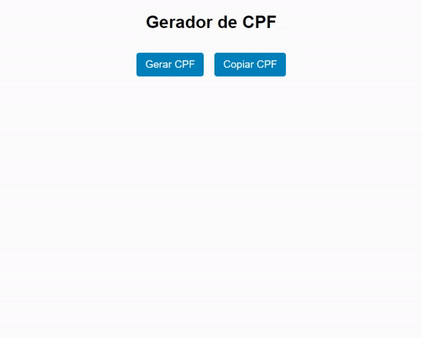

# Gerador de CPF

Projeto desenvolvido em HTML,CSS e Java Script. O site desenvolvido é um gerador de CPF com números válidos, possibilitando assim ser usado para testes em APIs e outras aplicações.

🔗 [Click here to access](https://n4ju15.github.io/gerador_de_cpf/)

## Tecnologias

- HTML
- CSS
- JavaScript
- Git and Github

